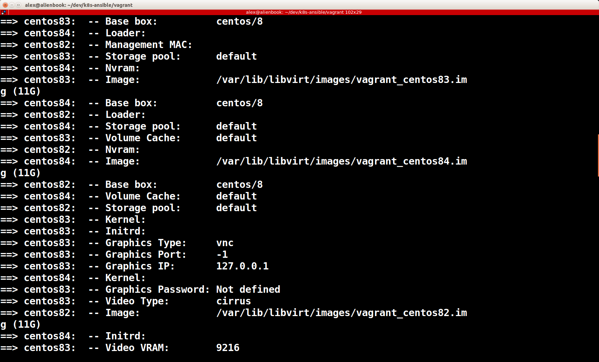
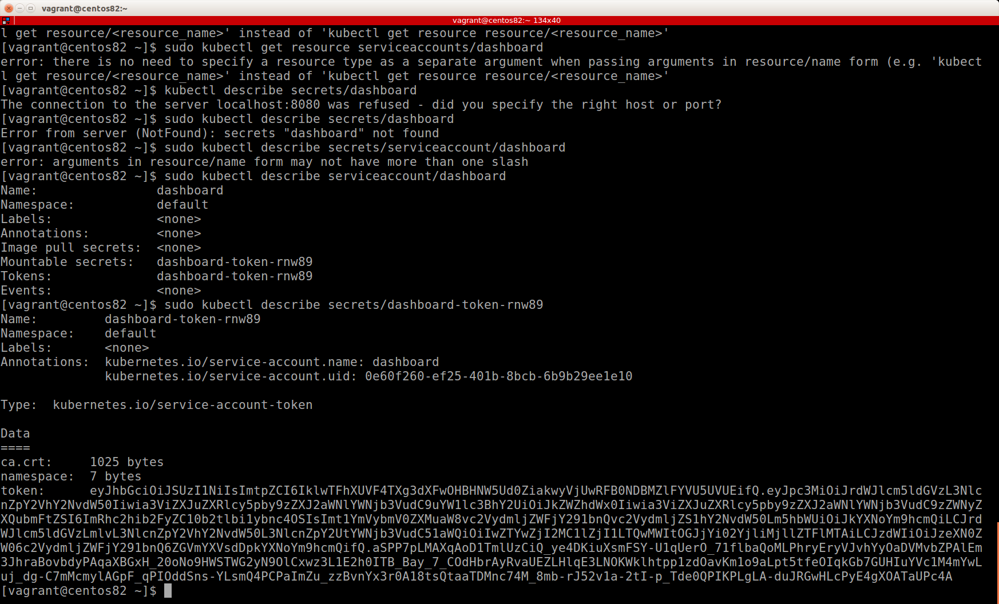
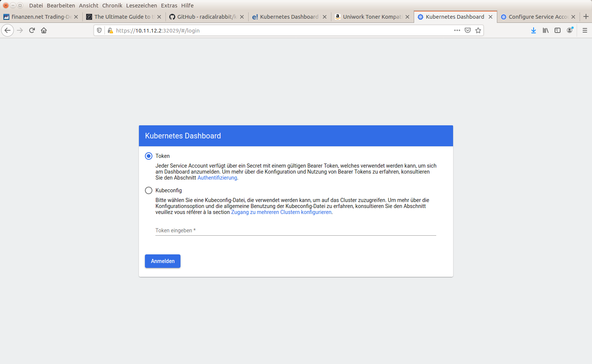
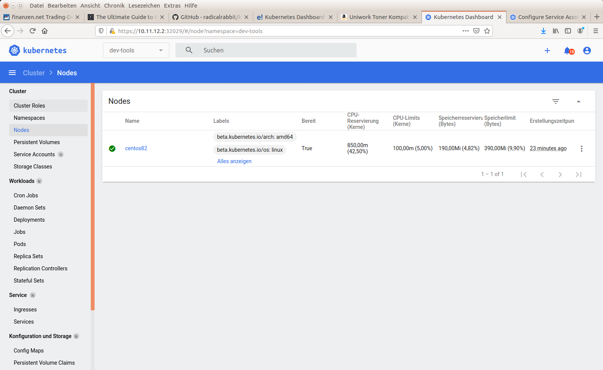
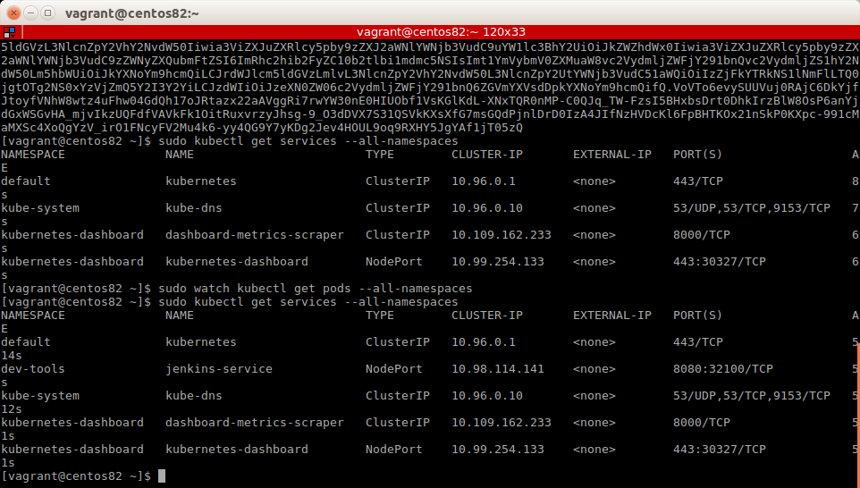
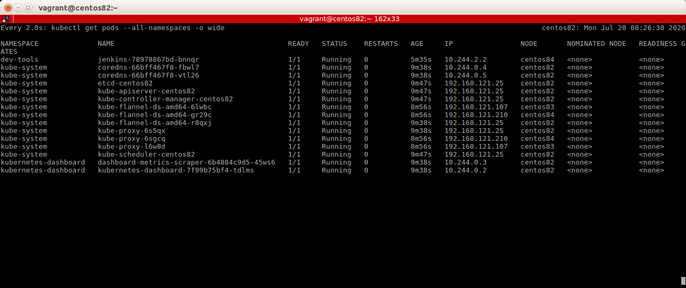
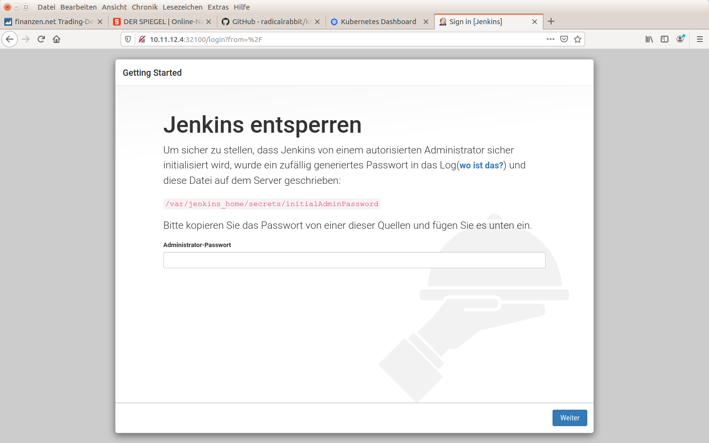
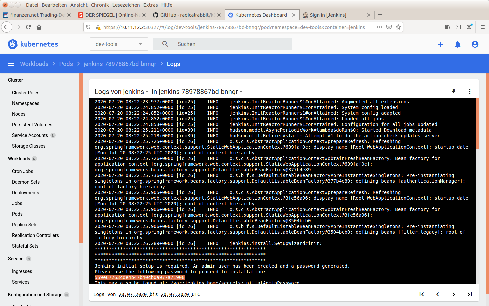
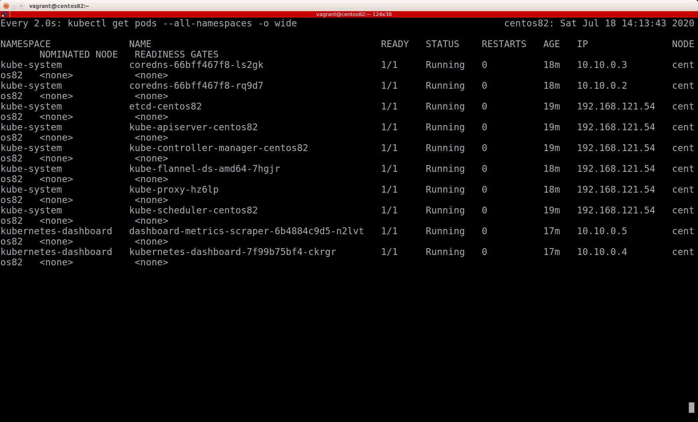

# Table of Contents
- [Installing Vagrant](#installing-vagrant)
- [Configuring the Host Addresses](#configuring-the-host-addresses)
- [Complete Installation of K8s via Script (including Vagrant VMs)](#complete-installation-of-k8s-via-script--including-vagrant-vms-)
- [Manual Installation (Step-by-Step Guide)](#manual-installation--step-by-step-)
  * [Prepare the Vagrant Boxes](#prepare-the-vagrant-boxes)
  * [Setup the Kubernetes Cluster with Ansible (Ubuntu 18.04)](#setup-the-kubernetes-cluster-with-ansible--ubuntu-1804-)
    + [Prerequisites](#prerequisites)
    + [Install the K8s Master Node](#install-the-k8s-master-node)
    + [Install the K8s Worker Node(s)](#install-the-k8s-slave-node-s-)
  * [Setup the Kubernetes Cluster with Ansible (CentOS 8)](#setup-the-kubernetes-cluster-with-ansible--centos-8-)
    + [Prerequisites](#prerequisites-1)
    + [Install the K8s master node](#install-the-k8s-master-node-1)
    + [Install the K8s slave node(s)](#install-the-k8s-slave-node-s--1)
- [Setup additional Kubernetes Services using Ansible](#setup-additional-kubernetes-services-using-ansible)
  * [Kubernetes Dashboard](#kubernetes-dashboard)
  * [Atlassian Jira](#atlassian-jira)
  * [Atlassian Confluence](#atlassian-confluence)
  * [Atlassian Bitbucket](#atlassian-bitbucket)
  * [Nexus Artifact Management](#nexus-artifact-management)
  * [GitLab](#gitlab)
  * [Jenkins CI Build Server](#jenkins-ci-build-server)
- [Cheatsheet :: Useful Commands](#cheatsheet----useful-commands)
  * [Vagrant](#vagrant)
  * [Kubernetes](#kubernetes)
- [Sources and References](#sources-and-references-)

# Installing Vagrant
The Kubernetes node VMs in this project are created by using Vagrant box images. First of all please install Vagrant before proceeding with the next steps:

CentOS:
```
# sudo dnf -y install https://releases.hashicorp.com/vagrant/2.2.9/vagrant_2.2.9_x86_64.rpm
# vagrant --version
# sudo vagrant plugin install vagrant-libvirt
```

Debian/Ubuntu:
```
$ curl -O https://releases.hashicorp.com/vagrant/2.2.9/vagrant_2.2.9_x86_64.deb
$ sudo apt install ./vagrant_2.2.9_x86_64.deb
$ vagrant --version
$ sudo vagrant plugin install vagrant-libvirt
```

The virtual machines for the K8s cluster can also be installed manually. Nevertheless Vagrant is the perfect choice to create lightweight VMs in less time by using a reproducible installation process (see https://www.vagrantup.com/).

Note: I recommend to use at least 8Gb of RAM and 2 CPU cores for each cluster node (both master and worker nodes).

# Configuring the Host Addresses

* Clone the repository: git clone https://github.com/radicalrabbit/K8s-ansible.git
* Create multiple servers (e.g. Centos). One master and 1-n workers. 
* Provide the 'ad_addr' in the env_variables file by setting the IP address of the Kubernetes 
* Add the IP Addresses of the worker nodes and the master node in the 'hosts' file.
* Proceed with the steps described below according to your OS (e.g. CentOS).

# Complete Installation of K8s via Script (including Vagrant VMs)
If you want to perform the full setup of one master node and three worker nodes (Vagrant setup und K8s installation) just execute the following script in the root directory of the project:
```
$ ./setup_cluster_CentOS.sh
```
Make sure both Vagrant and Ansible are available on your local system - as described above.

# Manual Installation (Step-by-Step Guide)
In contrast to the automatic setup described in the previous chapter the subsequent sections show the manual steps for the complete K8s cluster installation.

## Prepare the Vagrant Boxes

Preparing the virtual machines for the K8s cluster is quite easy. If you have an installation of vagrant (version >= 2.9) on you local system just execute the two commands below:
```
$ cd vagrant
$ sudo vagrant up
```
After executing the "vagrant up" command three virtual machines will be prepared on your local system. The hosts centos82, centos83 and centos84 will be provisioned from the official Vagrant CentOS8 base box image. The installation will give you a whole heap of console output as shown in the image below.


## Setup the Kubernetes Cluster with Ansible (Ubuntu 18.04)
The following sections describe the manual installation of all required packes on Ubuntu OS.

### Prerequisites
The installation artifacts provided in this repository require an installation of Ansible (>= 2.9). Please execute the following commands inside a terminal console of your system:
```
$ sudo apt update && sudo apt upgrade -y
$ sudo apt install software-properties-common -y
$ sudo apt install python3
$ sudo apt install python3-pip
$ pip3 install openshift pyyaml kubernetes
$ sudo apt-add-repository --yes --update ppa:ansible/ansible
$ sudo apt install ansible -y
$ ansible --version
$ pip3 --version
```
After update and installation procedure have successfully completed the last of the commands above should deliver a command prompt similar to "ansible 2.9.*".

Beyond the software modules listed above the Ansible scripts also require a running SSH server demon on the target system. Check if a running SSH server is available on your system by executing the subsequent command:
```
$ systemctl status sshd
```
If you should get any other information that "active (running)" you will probably need to install and activate the SSH demon:
```
$ sudo apt-get install openssh-server
$ sudo apt-get install openssh-client
$ sudo systemctl status ssh
$ sudo ufw allow ssh
$ systemctl status sshd
```
### Install the K8s master node
TBD

### Install the K8s slave node(s)
TBD

## Setup the Kubernetes Cluster with Ansible (CentOS 8)

### Prerequisites
The installation artifacts provided in this repository require an installation of Ansible (>= 2.9). Please use the following commands inside a terminal console of your system (Note: Some of the subsequent commands must be confirmed using the "y" key):

```
# sudo dnf makecache
# sudo dnf install epel-release
# sudo dnf makecache
# sudo dnf install python3
# pip3 install openshift pyyaml kubernetes
# sudo dnf install ansible
# ansible --version
# pip3 --version
```
After update and installation procedure have successfully completed the last of the commands above should deliver a command prompt similar to "ansible 2.9.*".

Beyond the software modules listed above the Ansible scripts also require a running SSH server demon on the target system. Check if a running SSH server is available on your system by executing the subsequent command:
```
systemctl status sshd
```
If you should get any other information that "active (running)" you will probably need to install and activate the SSH demon:
```
# dnf install openssh-server
# systemctl start sshd
# systemctl enable sshd
# systemctl status sshd
# firewall-cmd --zone=public --permanent --add-service=ssh
# firewall-cmd --reload
# systemctl reload sshd
```

### Install the K8s Master Node
After installing Ansible you can start to work with the installatiob scripts provided in the Git repository:

* Clone the according GitHub repository: git clone https://github.com/radicalrabbit/K8s-ansible.git
```
# git config --global credential.helper store
# git pull
```
* Create one or multiple server nodes (CentOS and Ubuntu supported), e.g. one master and arbitrary slave-/worker-nodes (e.g. KVM,VirtualBox).
* Change the “ad_addr” in the env_variables file with the IP address of the Kubernetes master node.
* Add the IPs of the master and slave nodes in the according "hosts" file.
* Run the subsequent following commands to setup Kubernetes nodes and services.
```
# sudo ansible-playbook setup_master_node.yml
```

### Install the K8s Worker Node(s)
After the master node setup has finished, run the subsequent command to set up the K8s slave node(s).
```
# sudo ansible-playbook setup_worker_nodes.yml
```
Once the nodes have joined the cluster, run the following command to check the status of the respective slave nodes.
```
# kubectl get nodes -o wide
```

# Setup additional Kubernetes services using Ansible
TBD

## Kubernetes Dashboard
The installation of the K8s Dashboard service is automatically executed in the master nodes Ansible setup (Ansible file located in services/dashboard.yml). The login procedure requires the admin security token of your K8s cluster. Either copy the token of your K8s setup from the command line output (K8s master node setup) or execute the subsequent command in a console window of ypur master node:
```
$ sudo kubectl describe serviceaccount/dashboard
$ sudo kubectl describe secrets/dashboard-token-*****
```


The dashboard security token should look similay to the example in the image above. The K8s dashboard should be available with an external browser (outside of the K8s network):

Look for the NodePort entry. In both commands you should find a result entry for the NodePort, usually a five digit port number (e.g. 30908):
```
$ sudo kubectl -n kube-system get services --all-namespaces
$ sudo kubectl describe services kubernetes-dashboard --namespace=kubernetes-dashboard
```

Take the port information from above and combine it with the K8s master IP:
```
$ https://10.11.12.2:30908/#/login
```
You will probably get a warning telling you that the SSL certifiacte is unsafe (unsigned). Accept and proceed to the login page of the dashboard. The image below shows the stand login page of the K8s dashboard.

After logging in with the dashboard secret token that you acquired with the commands above you are ready to use the dashbaord. The dashboard helps you to control the K8s cluster. I personally prefer the terminal console to add nodes or t0 deploy pods in my K8s network. Nevertheless the dashboard provides a very good overview on the most important information about your K8s pods, service, configuration, etc.

## Atlassian Jira
TBD
```
$
```

## Atlassian Confluence
TBD
```
$
```

## Atlassian Bitbucket
TBD
```
$
```

## Nexus Artifact Management
In this subsection I will explain how to create a deployment for the Nexus artifact management application. If you cluster setup is up, running and in a healthy condition execute the subsequent command:
```
$ sudo ansible-playbook setup_nexus.yml
```

After the deployment procedure has finished the Nexus App should be available in an external browser. In this case the pod has been deployed to the CentOS84 node. If you did not change the IP setup for the cluster node, CentOS84 should be accessible at "10.11.12.4". If the app has been deployed to the node CentOS84 the address should be:
```
http://10.11.12.4:32000/
```
According to the node to which the application has been deployed the respective IP could also be "10.11.12.3" or "10.11.12.2". Take a look into your K8s dashboard if you are not sure to which node the app has been deployed. 
## GitLab
I prefer to use Bitbucket for hosting my Git repositories. Nevertheless I also created an installation routine for a GitLab service inside the K8s cluster.
```
$
```
TBD
## Jenkins CI Build Server
With a running K8s cluster and a running Git instance we are ready to deploy a Jenkins server. Use the command below to deploy a Jenkins pod to your K8s cluster:
```
$ sudo ansible-playbook setup_jenkins.yml
```
Now we need the NodePort of the Jenkins instance and the IP of the node to which the pod has been deployed. Use the command below to find the according port:
```
$ sudo kubectl get services --all-namespaces
```
You should see a list of known services analogous to the screenshot below.

Now we nee the information to which node the pod has bee deployed. Use the subsequent command to get the according node:

In our case the Jenkins mod has been deployed to the node centos84. From this follows that the Jenkins UI is running at http://10.11.12.4:32100. A fresh and clean installation of Jenkins usually shows a page asking for the initial password (see image below).

You can get the according key either directly from the Jenkins installation directory (SSH to the server node) or from the Kubernetes dashboard log. The screenshot below shows the log view of a running Jenkins pod.

Copy the initial password and sign-in to the Jenkins UI. In the next step you will be asked to install additional plug-ins. 

TBD

One of the most significant advantages of a K8s-driven Jenkins is that we can use the pod network of the K8s cluster for build processes. The following lines describe the installation process for Docker-in-Docker using the K8s pod network.

TBD

# Cheatsheet :: Useful Commands
The following subsections describe some of the most frequent used commands in context of you Kubernetes cluster network.

## Vagrant
The following commands might be useful while playing around with the Vagrant machines.

Bring up Vagrant boxes:
```
$ sudo vagrant up
```

Suspend the running Vagrant boxes:
```
$ sudo vagrant suspend
```

Halt the running Vagrant boxes:
```
$ sudo vagrant halt
```

Get a list of all local Vagrant boxes:
```
$ sudo vagrant global-status
```

Remove all local Vagrant boxes:
```
$ sudo vagrant box list | cut -f 1 -d ' ' | xargs -L 1 vagrant box remove -f
```

Clear the local lost of Vagrant boxes:
```
$ sudo vagrant global-status --prune
```

Destroy known Vagrant boxes:

```
$ sudo vagrant destroy
```

Remove the known SSh keys, e.g. if one or multiple Vagrant boxes have been destroyed. This command will be necessary before re-creating a VM box, e.g. with the formerly used IP 10.11.12.2:
```
$ sudo ssh-keygen -R 10.11.12.2
```

## Kubernetes

The following command shows all K8s nodes which are currently connected to the cluster network:
```
$ sudo kubectl get nodes
```

The following command also shows all K8s nodes which are currently connected to the cluster network, including some more detailed information on the nodes (e.g. label and node type):
```
$ sudo kubectl get nodes --show-labels
```

Assign a role label to a certain node (e.g. master or worker):
```
$ sudo kubectl label node centos82  node-role.kubernetes.io/master=master
$ sudo kubectl label node centos83  node-role.kubernetes.io/worker=worker
$ sudo kubectl label node centos84  node-role.kubernetes.io/worker=worker
```

This command collects cluster node information, e.g. available RAM and CPU. The command below provides all available information for node "centos82":
```
$ sudo kubectl describe node centos82
```

Get all running K8s pods in all known namespaces:
```
$ sudo kubectl get pods --all-namespaces
```
The command above will show a list of known pod deployments in your cluster (see example below).



With this command you can watch the K8s container creation process. The following command refreshes the results list for "flannel" pods every 2.0 seconds:
```
$ sudo watch kubectl get pods -n flannel

```
The command above can also be used for other pods and namespaces (e.g. all namespaces):
```
$ sudo watch kubectl get pods --all-namespaces
```

The subsequent commands lists all known K8s services in the currently known namespaces:
```
$ sudo kubectl get services --all-namespaces
```

Deleting a deployment, e.g. the K8s dashboard:
```
$ kubectl delete deployment kubernetes-dashboard --namespace=kube-system.
```

Get information on a deploymnet failure (e.g. dashboard pod):
```
$ sudo kubectl -n kubernetes-dashboard describe pod kubernetes-dashboard-7f99b75bf4-6jblg
```

# Sources and References
* https://docs.ansible.com/ansible/latest/installation_guide/intro_installation.html#installing-ansible-on-ubuntu
* https://devopscube.com/setup-nexus-kubernetes/
* https://github.com/ctienshi/kubernetes-ansible
* https://www.edureka.co/blog/install-kubernetes-on-ubuntu
* https://www.edureka.co/blog/kubernetes-dashboard/
* https://linuxconfig.org/install-ssh-server-on-redhat-8
* https://linuxize.com/post/how-to-enable-ssh-on-ubuntu-18-04/
* https://phoenixnap.com/kb/install-kubernetes-on-ubuntu
* https://www.digitalocean.com/community/tutorials/so-installieren-und-verwenden-sie-docker-auf-ubuntu-18-04-de
* https://github.com/kubernetes/dashboard/releases
* https://docs.projectcalico.org/getting-started/kubernetes/quickstart
* https://upcloud.com/community/tutorials/install-kubernetes-cluster-centos-8/
